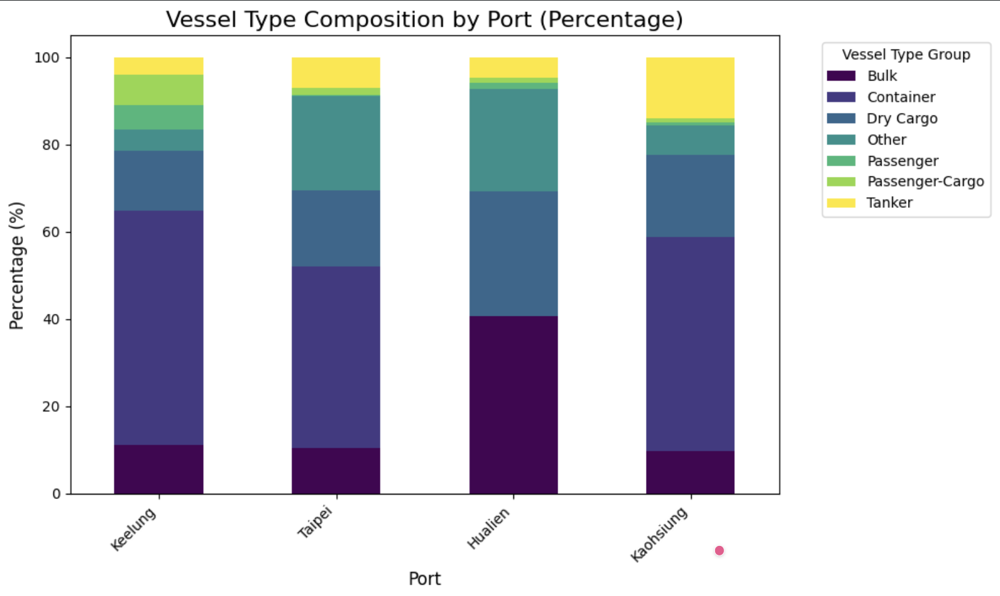
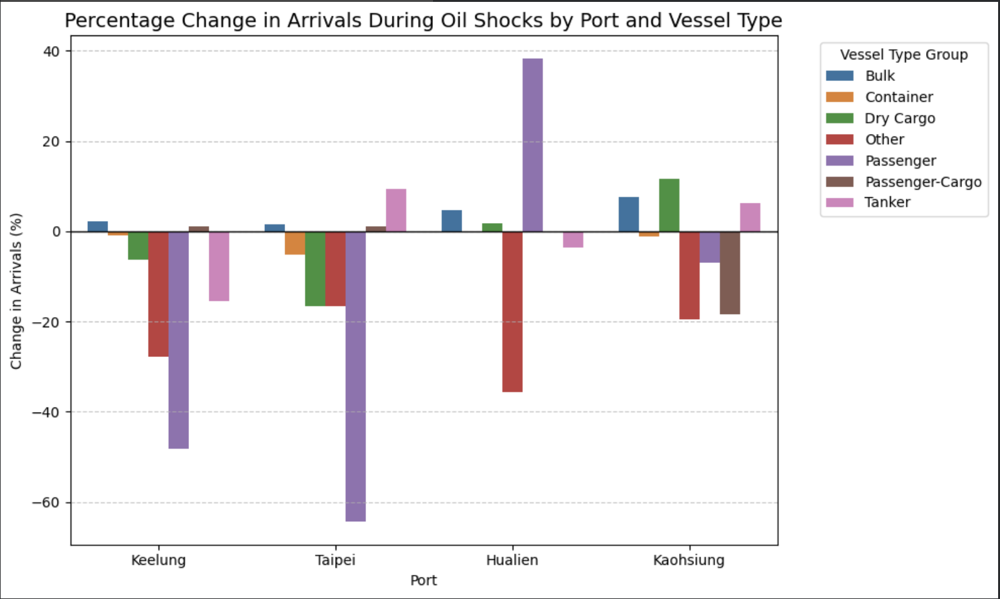

# Navigating the Shockwave: The Impact of Oil Price Shocks on Vessel Operations and Carbon Emissions at Taiwan's Ports

## Project Description

This project uses vessel arrival records, monthly oil prices and geopolitical shock events, and container throughput (TEU) data from Taiwan's four major international ports (Keelung, Taipei, Hualien, and Kaohsiung) to examine the impact of oil price shocks and geopolitical events on port vessel operations (arrival volume, vessel type composition, dwell time) and carbon emissions (estimated using the IMO empirical formula as `estimated_co2`).

Analysis methods include:
- Estimating per-vessel carbon emissions using the IMO empirical formula, and using regression analysis to examine the relationship between oil prices, carbon emissions, and the oil price shock interaction term
- Comparing vessel type composition and oil price shock sensitivity across ports
- Performing unsupervised clustering of vessels using KMeans (k = 4) and analyzing each cluster's sensitivity to oil price shocks
- Time-series regression analysis of TEU and arrival volume by cluster (including lagged terms and port fixed effects)
- Correlation heatmap of oil prices, arrival volume, and carbon emission proxy indicators

## Getting Started

### Environment Requirements

- **R**: Requires the `readr`, `dplyr`, `tidyr`, `tibble`, `stringr`, `lubridate`, and `ggplot2` packages (for running [esg.R](esg.R) and [visualization_big_data_g7.R](visualization_big_data_g7.R))
- **Python**: Requires the `pandas`, `numpy`, `matplotlib`, `seaborn`, `scikit-learn`, `statsmodels`, and `scipy` packages
### Obtaining the Data

The `data/` folder is not tracked in version control (see [.gitignore](.gitignore)). Please download the data from the link below and place it in the `data/` folder at the project root:
https://drive.google.com/drive/folders/1QRtu7Nj-4uAfTyKZ1MEvrgiaTj1LyAYd?usp=sharing

| Category | Dataset Name | Source | Data Level | Purpose |
|----------|-------------|---------|------------|----------|
| Oil price data | Brent Crude Oil Price | FRED (POILBREUSDM) | Monthly / Time series | Measure international oil prices |
| Geopolitical event data | Geopolitical Shock Label | Manually constructed | Monthly / Event labels | Mark each geopolitical crisis |
| Arrival data | Port arrival vessel data | Taiwan Port Net Service | Vessel level / Daily data | Count monthly arrivals and vessel-type composition per port |
| Departure data | Port departure vessel data | Taiwan Port Net Service | Vessel level / Daily data | Calculate monthly departures and port stay duration per port |
| Port statistics data | TEU, cargo volume, vessel stats | iMarine Port Development Database | Port level / Monthly/Yearly | Supplement port cargo throughput and overall activity indicators |

### Running the Analysis

Run the following from the project root directory (the `data_path` in the scripts has been changed to the relative path `"data"`):

```r
source("esg.R")
source("visualization_big_data_g7.R")
```

- After running [esg.R](esg.R), charts will be displayed directly via `print()`
- [visualization_big_data_g7.R](visualization_big_data_g7.R) will export all charts to `visualization_big_data_g7_plots.pdf`

## File Structure

```
.
├── esg.py / esg.R                              # ESG carbon emission estimation and regression analysis (esg.R was converted from the Colab version esg.py)
├── visualization_big_data_g7.py / .R           # Full analysis of port vessel traffic, KMeans clustering, TEU regression, etc.
└── data/                                       # Raw and cleaned data (not version-controlled, must be downloaded separately)
    ├── cleaned_all_inport.csv                  # Vessel-level arrival records
    ├── final_port_month.csv                    # Port x year-month aggregated statistics (including oil price, oil shock flags, event names)
    ├── inport_month.csv
    ├── resilience_arrivals.csv
    ├── waiting_check_by_port.csv
    └── 臺灣國際商港貨櫃裝卸量.csv                # Monthly container throughput (TEU) by port
```

## Analysis

1. **ESG Carbon Emission Analysis** ([esg.R](esg.R)): Estimates per-vessel carbon emissions using the IMO empirical formula, and uses regression models to examine the impact of "oil price" and "oil price shock" on carbon emissions, along with a t-test comparing oil prices between shock months and normal months
- IMO Methodology
$$E_{\text{CO}_2} = \left( T \times P_{\text{aux}} \times LF \times SFC \times CF \right) \times 10^{-6}$$
- OLS Interaction Model
$$\text{estimated\_co2}_{ipt} = \beta_0 + \beta_1 \cdot \text{oil\_price}_t + \beta_2 \cdot \text{any\_shock}_t + \beta_3 \cdot (\text{oil\_price}_t \times \text{any\_shock}_t) + \mathbf{\Gamma} \cdot \mathbf{X}_{ipt} + \alpha_p + \delta_{\text{year}} + \lambda_{\text{month}} + \epsilon_{ipt}$$
2. **Port and Vessel Traffic Analysis** ([visualization_big_data_g7.R](visualization_big_data_g7.R)):
   - Comparison of vessel type composition across ports
   - Sensitivity of each port (and each vessel type/cluster) to oil price shocks
   - Correlation analysis between lagged oil price changes and arrival volume
   - Impact of specific geopolitical events (e.g., Hormuz Strait Crisis, Israel-Iran War) on vessel arrivals
   - KMeans (k = 4) unsupervised clustering and each cluster's sensitivity to shocks
   - Time-series regression analysis of TEU and arrival volume by cluster
   - Correlation heatmap of oil prices, arrival volume, and carbon emission proxy indicators

## Results

**Impact of Oil Shocks on Port Operations and Vessel Dynamics**

**Executive Summary**
This analysis explores the resilience and vulnerability of port operations and vessel traffic in Taiwan's major international ports (Keelung, Taipei, Hualien, Kaohsiung) to oil price shocks and geopolitical events. Using a combination of descriptive statistics, clustering analysis, time-series visualizations, and regression models, we identify distinct patterns of response across different ports and vessel types. Key findings indicate significant variations in sensitivity, the importance of port specialization, and a nuanced relationship between oil prices and port-related emissions.

**1. Vessel Type Composition by Port**


Ports exhibit clear specializations:

**Keelung & Kaohsiung:** Predominantly handle Container vessels (approx. 53.8% and 49.9% respectively), signifying their roles as major container hubs.

**Taipei:** Shows a diverse composition, with significant Container (41.6%), 'Other' (21.5%), and Dry Cargo (17.5%) traffic, indicating a broader range of activities.

**Hualien:** Heavily dominated by Bulk (40.7%) and Dry Cargo (28.6%) vessels, with virtually no Container traffic, highlighting its focus on commodity movements.

**2. Overall Port Sensitivity to Oil Shocks**

High-level analysis of average monthly arrivals during oil shock periods reveals varying vulnerabilities:

**Hualien Port:** Most sensitive, experiencing a -14.26% drop in average monthly arrivals during shocks.

**Taipei Port: **Also significantly affected, with a -9.16% decrease.
Keelung Port: Shows a moderate decline of -5.86%.

**Kaohsiung Port:** The most resilient, with only a -2.99% drop, reinforcing its status as a critical global gateway.

**3. Sensitivity Analysis by Port and Vessel Type**
Detailed examination shows that impact varies by vessel type within each port:

**Keelung Port:** Dry Cargo (-6.4%) and Passenger (-48.3%) vessels are highly vulnerable. Bulk vessels surprisingly show a slight increase (+2.3%), while Container traffic sees a minor decrease (-0.85%).

**Taipei Port:** Experiences broad declines across major vessel types (Bulk: -17.9%, Dry Cargo: -16.9%, Container: -13.1%).

**Hualien Port:** Bulk (-15.8%) and Dry Cargo (-27.0%) are negatively impacted. Passenger traffic also drops significantly (-42.9%), but 'Other' vessels show a substantial increase (+92.5%), suggesting unique operational dynamics or re-routing.

**Kaohsiung Port:** Demonstrates resilience across major types; Container (-1.25%), Bulk (-2.98%), and Dry Cargo (-0.97%) show only minor changes. Tanker arrivals surprisingly increase (+6.14%).

**4. Arrival Frequency Trends with Shock/Recovery**
Visualizations of monthly arrival trends confirm the quantitative findings. Red-shaded 'Shock' periods often correlate with dips in arrivals, followed by varied recovery patterns in green-shaded periods. Passenger vessels are highly volatile, while major Container and Bulk traffic in key ports tend to be more stable, with some exceptions during severe shocks.

**5. Lagged Effects and Specific Event Impact
Lagged Effects:**

Correlation between lagged oil price changes (up to 3 months) and vessel arrivals is generally weak for most vessel types. This suggests that market reactions are either immediate or driven by more complex, non-linear factors.

**Specific Events:** Geopolitical events (e.g., Hormuz Crisis, Abqaiq-Khurais Attack) have a clear and significant impact. For example, the Hormuz Crisis led to substantial drops in Bulk (-33.8%) and Dry Cargo (-43.7%). The 'Other' vessel category shows extreme volatility, with large increases or decreases depending on the event, indicating high sensitivity.

**6. Unsupervised Learning Clustering Analysis (K=4)**
Clustering of vessels based on gross_tonnage, berth_wait_hours, and vessel_type_group reveals four distinct behavioral groups:

**Cluster 0 (Mixed Short-haul & Regional Fleet):** Average tonnage ~9.7K tons, short wait (0.45 hrs). Diverse, frequent operations.

**Cluster 1 (Long-haul Giant Container Vessels):** Highest average tonnage (~103K tons), slightly longer wait (0.57 hrs). Dominated by large container ships, theoretically most sensitive to global oil prices.

**Cluster 2 (High-Efficiency Regional Containers):** Moderate tonnage (~18.5K tons), shortest wait (0.37 hrs). Optimized for rapid turnaround in regional container traffic.

**Cluster 3 (Extreme Operational Outliers):** Very small group (7 vessels), moderate tonnage (3.3K tons) but extremely long wait times (249 hours). Excluded from trend analyses due to statistical insignificance and anomalous behavior.

**7. Cluster Structure Analysis Per Port**
**Hualien:** Almost exclusively composed of Cluster 0 (99.2%), reinforcing its specialized bulk/dry cargo role.

**Taipei & Keelung:** Mix of Cluster 0, 1, and 2, but with a higher proportion of regional container (Cluster 2) traffic.

**Kaohsiung:** A balanced mix across all operational clusters, reflecting its comprehensive and diverse operations as a major international port.

**8. Oil Shock Sensitivity Analysis by Cluster**

**Cluster 0 (Mixed Short-haul):** Shows a -7.11% decline in arrivals during oil shocks, suggesting that smaller, more flexible operations are often curtailed.

**Cluster 1 (Giant Container):** Experiences a -9.32% decline, indicating that even large, essential container movements are not immune to oil price pressures.

**Cluster 2 (High-Efficiency Regional Containers):** Least impacted, with a -2.41% decrease, possibly due to their optimized operations and shorter routes.
**Cluster 3:** Excluded from this analysis due to its extreme rarity and outlier nature.
Port-specific Cluster Sensitivity:

**Hualien's Resilience Paradox:** While most clusters decline, Cluster 1 at Hualien shows a massive increase (+92.45%), but this is likely due to a very low baseline of giant vessel arrivals.

**Taipei and Keelung Vulnerability:** Both show double-digit drops in Cluster 0, indicating sensitivity in their regional traffic.

**Kaohsiung's Stability:** Continues to show the most stability across all clusters, with minor drops, cementing its role as a stable global trade hub.

**9. Lagged Effects of Oil Price Changes by Cluster**
Similar to vessel types, correlations between arrival_count and lagged oil_change for individual clusters are generally very weak (close to zero). This further supports the conclusion that direct lagged oil price movements are not strong predictors of cluster arrival frequencies.

**10. Impact of Specific Oil Shock Events by Cluster**
Specific geopolitical events cause quantifiable impacts on cluster arrivals:

**Cluster 0 (Mixed Short-haul):** Generally experiences significant negative impacts (e.g., Hormuz Crisis: -36.48% drop). Some events, like 'US-Iran Sanctions', show an increase (+10.18%), possibly due to re-routing.

**Cluster 1 (Giant Container):** Vulnerable, with declines during 'Israel-Hamas War' (-25.10%) and 'Hormuz Crisis' (-18.61%). 'US-Iran Sanctions' leads to a substantial increase (+38.54%), implying strategic redirection.

**Cluster 2 (High-Efficiency Regional Containers):** Shows mixed, often negative responses (e.g., 'Hormuz Crisis': -21.82%), but also increases during events like 'US-Iran Sanctions'.
Extreme Disruptions: Events like 'US-Israel-Iran War' led to near-complete cessation for Cluster 0 (-99.64%), highlighting severe, potentially localized, disruptions.

**11. TEU Analysis**
OLS regression on TEU (Twenty-foot Equivalent Unit) volumes shows:

**Strong Autoregressive Component:** teu_lag_1 is highly significant and positive (coef = 0.68, p < 0.001), meaning past TEU volumes are a strong predictor of current volumes.

**Oil Price Insignificance:** oil_change, oil_change_pct, and oil_shock variables are not statistically significant predictors of TEU volume (p-values > 0.05). This suggests that monthly TEU volumes, while volatile, are not directly explained by the absolute or percentage changes in oil prices, nor by the presence of a generalized oil shock in this model specification.

**Port Fixed Effects:** C(port) shows significant effects, indicating inherent differences in TEU volumes across ports (e.g., Kaohsiung has a much higher baseline).

**12. Vessel Cluster Regression Analysis**
Separate OLS regression models for Clusters 0, 1, and 2, controlling for lagged arrival counts and port fixed effects:

**Strong Autoregressive Effects:** arrival_count_lag_1 is highly significant and positive across all clusters, indicating strong persistence in arrival frequencies.

**Oil Price Changes:** oil_change (current and lagged) generally shows insignificant coefficients for most clusters, similar to the TEU analysis. There are occasional weak significances (e.g., oil_change_lag_2 for Cluster 0), but no consistent, strong, or direct impact on arrival counts.

**Oil Shock Variable:** The oil_shock dummy variable is also largely insignificant across clusters, suggesting that once lagged arrival counts and other factors are controlled, the binary 'shock' indicator itself doesn't add much explanatory power to arrival volumes.

**Port Fixed Effects:** C(port) remains significant, reflecting inherent differences in arrival baselines across ports for each cluster.

**13. ESG Correlation Heatmap: Oil vs. Idling / Emissions Proxies**
This analysis explores the potential for "Passive Decarbonization":

**Oil Price and CO₂ Proxy:** The correlation between absolute oil_price and total_co2_proxy is very weak positive (0.02). The correlation between oil_change_pct and total_co2_proxy is very weak negative (-0.02). This means higher oil prices do not strongly correlate negatively with CO₂ proxy, and a percentage change in oil price has only a minimal negative correlation.

**Traffic Volume and Emissions:** total_vessels (arrivals) is strongly positively correlated (0.97) with total_co2_proxy. This supports the idea that fewer arrivals directly lead to lower total port emissions.

**Idling Time and Emissions:** avg_berth_wait is also moderately positively correlated (0.41) with total_co2_proxy, confirming that shorter idling times reduce emissions.

**Establishment of the "Fundamental Premise":** Geopolitics and the Energy Market
The research first confirms a high degree of causality between geopolitical events and oil prices. During normal, non-war periods, the average oil price is $67.48; however, during months with war outbreaks, the average price significantly spikes to $75.43 (a price difference of nearly $8). A T-test yields a P-value of 0.0008, reaching a highly significant level.

**The Dual Effect of High Oil Prices on Carbon Emissions in Peacetime vs. Wartime (Baseline: Per $10 Increase)**

🟢 Non-War Periods (Peacetime): For every $10 increase in international oil prices, the average carbon emission per vessel in Taiwan's port areas substantially increases by 0.061 tonnes (P=0.002). This result supports the "slow steaming and port congestion hypothesis"—during peacetime, high oil prices prompt carriers to collectively reduce speed at sea, leading to disrupted arrival schedules, passive port congestion, and prolonged generator fuel combustion.

🔴 Wartime Periods (Geopolitical Shock): When geopolitical conflicts erupt, for every $10 increase in oil prices, the average carbon emission per vessel only increases by 0.024 tonnes (the interaction term oil_price:any_shock is significantly negative at -0.0037, P=0.019).

**Core Academic Implication: Geopolitics as an Environmental "Safety Valve"**
Solid data reveals that the environmental degradation (carbon emission acceleration) caused by high oil prices during wartime is forcefully braked, effectively suppressing the increase by approximately 60%. This reflects that when geopolitical conflicts occur, major global supply chain detours (such as rerouting around the Cape of Good Hope) draw vessel capacity away from the Far East, inadvertently relieving congestion at Taiwan's ports. Simultaneously, under the immense time pressure of wartime crises, carriers drastically improve loading and unloading efficiency at non-direct warzone ports, thereby reducing unnecessary idling and energy consumption during berthing.

## Contributors
- YUN-SIN HUNG
- KAI-ZAO CHUANG
- Yu-Jou Chen
- ZIH-YUN LIAO
- Yee-Yun Chen

## Acknowledgments
- Pien Chung-pei

## References

- Colab Notebooks:
  - ESG Analysis: https://colab.research.google.com/drive/1didcFxwP3_Ekjxv5s3gHXaaCgPITE-5L
  - Port Traffic Visualization Analysis: https://colab.research.google.com/drive/1Kpz03VVdCKWx7QMkss37h-fGMqMWQmyV
- Data Sources: FRED (Brent Crude Oil Price, POILBREUSDM), Taiwan Port Net Service (vessel arrival/departure data), iMarine Port Development Database (TEU / cargo volume / vessel statistics) (see the table above for details)
